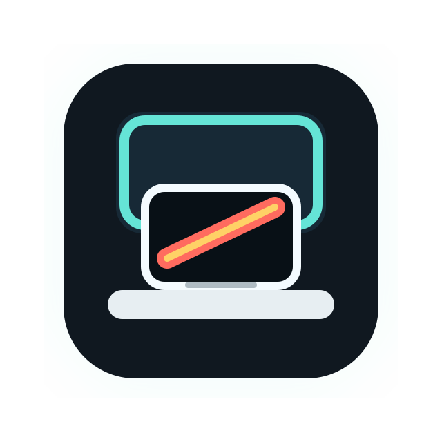

<div align="center">
  

  <h1>Clamless</h1>

  <p><strong>Disconnect your MacBook's built-in display without closing the lid.</strong></p>
  <p>Keep Touch ID, camera, keyboard, and microphone available while macOS behaves as if only the external display exists.</p>

  <p>
    <a href="https://github.com/TCXM/clamless/actions/workflows/release.yml"></a>
    <a href="https://github.com/TCXM/clamless/releases/latest"></a>
    <a href="LICENSE"></a>
    
  </p>

  <p>
    <a href="README.zh-CN.md">简体中文</a> ·
    <a href="https://clamless.yuxiaozhu.me/">Website</a> ·
    <a href="#install">Download</a> ·
    <a href="#menu-bar-app">Menu Bar App</a> ·
    <a href="#automatic-switching">Automatic Switching</a> ·
    <a href="#how-it-works">How It Works</a> ·
    <a href="#cli">CLI</a>
  </p>
</div>

<p align="center">
  <strong>Languages:</strong>
  <a href="README.md">English</a> ·
  <a href="README.zh-CN.md">简体中文</a>
</p>

> [!NOTE]
> Clamless targets Apple Silicon MacBooks on macOS 13 or newer. Current public builds are ad-hoc signed but not Apple-notarized yet, so first launch may require right-clicking the app and choosing **Open**.

## Why?

macOS gives you clamshell mode, brightness controls, and display arrangement settings, but none of those are the same as keeping a MacBook open while removing the built-in screen from the desktop layout.

Clamless is for desk setups where you want the MacBook open for Touch ID, camera, keyboard, microphone, or cooling, while the system behaves like the external monitor is the only usable display.

## What It Does

`clamless-display off` combines three actions:

1. Clears any display mirroring state that could keep macOS in a mirroring/sharing mode.
2. Removes the built-in display from the active macOS screen arrangement.
3. Requests the built-in Apple Silicon panel framebuffer to enter a low-power/off state.

The practical result is:

- the external display remains active;
- the built-in display is removed from the cursor/window layout;
- the cursor cannot move into the built-in display;
- the built-in panel is requested to turn off.

This is close to the practical behavior of Lunar BlackOut / BetterDisplay built-in display disconnect.

## How It Works

Clamless succeeds by combining two different macOS display layers:

1. **WindowServer/SkyLight layout control.** The helper loads the private
   `SkyLight.framework` symbols `SLSGetDisplayList` and
   `SLSConfigureDisplayEnabled`. This is the part that removes or restores the
   built-in display from the active macOS desktop arrangement, so the cursor
   cannot enter the built-in panel.
2. **Apple Silicon panel power control.** The helper loads the private
   `IOMobileFramebuffer.framework` symbols and calls
   `IOMobileFramebufferRequestPowerChange`. This is the part that asks the
   physical built-in panel to turn off or wake up.

Turning the built-in display off is therefore:

```text
clear mirroring
-> disable the built-in display in the SkyLight layout
-> request built-in panel power off through IOMobileFramebuffer
```

Turning it back on is:

```text
request built-in panel power on through IOMobileFramebuffer
-> enable the built-in display in the SkyLight layout
```

The important reconnect detail is that macOS can temporarily stop listing the
built-in display in SkyLight after a software disconnect. When that happens,
Clamless falls back to the built-in `IOMobileFramebuffer` service
(`disp0,...`) and uses `IOMobileFramebufferGetID` to recover the display ID
needed for `SLSConfigureDisplayEnabled`.

## What It Is Not

This is not:

- brightness dimming;
- a black overlay window;
- clamshell mode;
- a display-arrangement-only workaround;
- a way to physically remove the built-in panel from IORegistry.

The built-in panel is internal hardware, so it can still appear in lower-level system registries. The important user-facing display topology is the active WindowServer/CoreGraphics layout.

## Install

Download the latest `Clamless-<version>.dmg` from [GitHub Releases](https://github.com/TCXM/clamless/releases/latest), open it, and drag `Clamless.app` into `Applications`.

Until the app is signed with a Developer ID certificate and notarized by Apple,
macOS may show the standard unidentified-developer warning on first launch. In
that case, right-click `Clamless.app` and choose **Open**.

## Requirements

- Apple Silicon MacBook
- macOS 13 or newer
- At least one active external display before disconnecting the built-in display
- Xcode Command Line Tools for building from source

## Build From Source

```sh
make build
```

This creates:

```text
.build/clamless-display
.build/Clamless.app
```

## Install From Source

```sh
make install
```

The menu bar app is installed to:

```text
~/Applications/Clamless.app
```

Open it:

```sh
open "$HOME/Applications/Clamless.app"
```

## Package A Release

Public releases are built by GitHub Actions when a version tag is pushed:

```sh
git tag -a v0.1.5 -m "Clamless 0.1.5"
git push origin v0.1.5
```

The release workflow builds the DMG on a macOS arm64 runner, verifies the
checksum, creates a GitHub Release, and uploads the `.dmg` and `.sha256` files.

If the tag already existed before the workflow was added, run the `Release`
workflow manually and set `release_tag` to the existing tag, such as `v0.1.5`.

For local testing, run:

```sh
make dmg
```

This creates:

```text
dist/Clamless-<version>.dmg
dist/Clamless-<version>.dmg.sha256
```

For the smoothest public install experience, release builds should eventually
be signed with a Developer ID Application certificate and notarized before the
DMG is uploaded.

## Menu Bar App

The menu bar app exposes:

- one switch that turns the built-in display off or on based on current state;
- a settings window for automatic switching, login item control, and update checks;
- a quit command.

The menu bar title and menu text follow the user's preferred system language. Chinese is used for Chinese locales; English is used otherwise.

It calls the same bundled `clamless-display` helper. It does not implement a separate display-control path.

## Automatic Switching

Clamless can automatically turn off the built-in display when a trusted external display is connected, and turn it back on when that display is disconnected.

Automatic switching is whitelist-based:

- connected external displays appear in Settings;
- a new external display is not trusted by default;
- only checked displays can trigger automatic built-in display disconnect;
- Clamless only auto-restores displays that it previously auto-disconnected.

The Settings window uses CoreGraphics to show currently active external display
names. Display keys for the whitelist are read from
`IOMobileFramebuffer.DisplayAttributes.ProductAttributes`.

Automatic switching uses several signals because no single macOS display source
is reliable in this state:

- a 1-second status poll;
- CoreGraphics display reconfiguration callbacks;
- IORegistry interest notifications for display-port services;
- lower-level `AppleATCDPAltModePort.EventLog` `Plug`/`Unplug` timestamps;
- a safety restore when the built-in display is disconnected but the active
  CoreGraphics external-display count drops to zero.

The state machine treats unplug as a restore-priority event. A later low-level
`Plug` event is not allowed to cancel an already pending restore, because DP
Alt Mode relinking or WindowServer recovery can emit a newer plug-like event
even when the user has not intentionally reconnected the display.

## CLI

```sh
clamless-display status
clamless-display off --commit session
clamless-display on --commit session
clamless-display panel-on
```

Lower-level commands:

```sh
clamless-display layout-off
clamless-display layout-on
clamless-display panel-off
clamless-display panel-on
clamless-display panel-request 0
clamless-display panel-request 1
```

`panel-on` only wakes the physical built-in panel. It does not restore the display into the macOS layout.

## Start At Login

Open Clamless Settings and enable **Open at Login**.

For source builds, the helper scripts call the same macOS Login Items API used
by the app and remove older LaunchAgent files if they exist:

```sh
make login-install
```

Remove:

```sh
make login-uninstall
```

## Privacy

Clamless does not collect telemetry and does not send display information
anywhere. The menu bar app stores local preferences with macOS `UserDefaults`
under the `local.clamless.menu` bundle identifier.

## Caveats

This project uses private macOS APIs:

- `SkyLight.framework` display topology APIs
- `IOMobileFramebuffer.framework` Apple Silicon panel power APIs

Apple can change these APIs in future macOS releases. This project should be treated as a pragmatic local utility, not an App Store-style supported integration.

Reconnect can fail in some macOS states after a software disconnect. If that happens, first use emergency panel wake, then restore the layout through macOS Display Settings, a lid close/open cycle, external cable reconnect, or reboot.

## License

MIT
